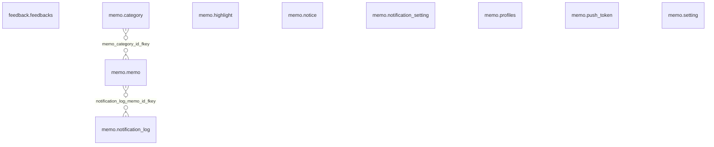

# Supabase 스키마

> 자동 생성 문서입니다. 직접 수정하지 마세요.
> 재생성: `pnpm generate-supabase-schema`

- Production 프로젝트: `czwtqukymcqoberdoltq`
- 스키마 범위: `feedback`, `memo`
- 외부 FK 참조는 상세 정보만 표시하며 ERD에서는 제외합니다.

## ERD

관계선은 FK 연결만 나타내며 카디널리티를 보장하지 않습니다.

## feedback

### feedback.feedbacks

RLS: true / FORCE RLS: false

#### 컬럼

| 순서 | 이름 | 타입 | NOT NULL | 기본값 |
| --- | --- | --- | --- | --- |
| 1 | id | bigint | true | 없음 |
| 2 | created&#95;at | timestamp with time zone | true | now() |
| 3 | content | text | false | 없음 |
| 4 | user&#95;id | uuid | false | auth.uid() |
| 5 | email | text | false | 없음 |

#### 제약

| 이름 | 종류 | 컬럼 (순서) | 참조 | 정의 |
| --- | --- | --- | --- | --- |
| feedbacks&#95;pkey | p | id | 없음 | PRIMARY KEY (id) |
| feedbacks&#95;user&#95;id&#95;fkey | f | user&#95;id | auth.users (id) — 외부 참조(세부 제외) | FOREIGN KEY (user&#95;id) REFERENCES auth.users(id) ON UPDATE CASCADE |

#### 인덱스

| 이름 | 정의 |
| --- | --- |
| feedbacks&#95;pkey | CREATE UNIQUE INDEX feedbacks&#95;pkey ON feedback.feedbacks USING btree (id) |

#### 정책

| 이름 | 명령 | PERMISSIVE | 역할 | USING | WITH CHECK |
| --- | --- | --- | --- | --- | --- |
| t | a | true | public | 없음 | true |

#### 트리거

| 이름 | 활성 상태 | 시점 | 이벤트 | 실행 단위 | 호출 대상 (인자 제외) |
| --- | --- | --- | --- | --- | --- |
| feedback | O | AFTER | INSERT | ROW | supabase&#95;functions.http&#95;request() |

## memo

### memo.category

RLS: true / FORCE RLS: false

#### 컬럼

| 순서 | 이름 | 타입 | NOT NULL | 기본값 |
| --- | --- | --- | --- | --- |
| 1 | id | bigint | true | 없음 |
| 2 | name | text | true | 없음 |
| 3 | user&#95;id | uuid | false | auth.uid() |
| 4 | created&#95;at | timestamp with time zone | true | now() |
| 5 | color | text | false | 없음 |
| 6 | memo&#95;count | integer | false | 0 |

#### 제약

| 이름 | 종류 | 컬럼 (순서) | 참조 | 정의 |
| --- | --- | --- | --- | --- |
| category&#95;pkey | p | id | 없음 | PRIMARY KEY (id) |
| category&#95;user&#95;id&#95;fkey | f | user&#95;id | auth.users (id) — 외부 참조(세부 제외) | FOREIGN KEY (user&#95;id) REFERENCES auth.users(id) ON UPDATE CASCADE ON DELETE CASCADE |

#### 인덱스

| 이름 | 정의 |
| --- | --- |
| category&#95;pkey | CREATE UNIQUE INDEX category&#95;pkey ON memo.category USING btree (id) |
| category&#95;user&#95;id&#95;name&#95;unique | CREATE UNIQUE INDEX category&#95;user&#95;id&#95;name&#95;unique ON memo.category USING btree (user&#95;id, lower(name)) |

#### 정책

| 이름 | 명령 | PERMISSIVE | 역할 | USING | WITH CHECK |
| --- | --- | --- | --- | --- | --- |
| all | &#42; | true | authenticated | (( SELECT auth.uid() AS uid) = user&#95;id) | (( SELECT auth.uid() AS uid) = user&#95;id) |

#### 트리거

없음

### memo.highlight

RLS: true / FORCE RLS: false

#### 컬럼

| 순서 | 이름 | 타입 | NOT NULL | 기본값 |
| --- | --- | --- | --- | --- |
| 1 | id | bigint | true | 없음 |
| 2 | user&#95;id | uuid | true | 없음 |
| 3 | url | text | true | 없음 |
| 4 | title | text | false | 없음 |
| 5 | favIconUrl | text | false | 없음 |
| 6 | exact&#95;text | text | true | 없음 |
| 7 | prefix&#95;text | text | false | 없음 |
| 8 | suffix&#95;text | text | false | 없음 |
| 9 | text&#95;position&#95;start | integer | false | 없음 |
| 10 | color | text | true | 'yellow'::text |
| 11 | note | text | false | 없음 |
| 12 | created&#95;at | timestamp with time zone | true | now() |
| 13 | updated&#95;at | timestamp with time zone | true | now() |

#### 제약

| 이름 | 종류 | 컬럼 (순서) | 참조 | 정의 |
| --- | --- | --- | --- | --- |
| highlight&#95;color&#95;check | c | color | 없음 | CHECK ((color = ANY (ARRAY&#91;'yellow'::text, 'green'::text, 'blue'::text, 'pink'::text, 'purple'::text&#93;))) |
| highlight&#95;pkey | p | id | 없음 | PRIMARY KEY (id) |
| highlight&#95;user&#95;id&#95;fkey | f | user&#95;id | auth.users (id) — 외부 참조(세부 제외) | FOREIGN KEY (user&#95;id) REFERENCES auth.users(id) ON DELETE CASCADE |

#### 인덱스

| 이름 | 정의 |
| --- | --- |
| highlight&#95;pkey | CREATE UNIQUE INDEX highlight&#95;pkey ON memo.highlight USING btree (id) |
| highlight&#95;user&#95;created&#95;idx | CREATE INDEX highlight&#95;user&#95;created&#95;idx ON memo.highlight USING btree (user&#95;id, created&#95;at DESC) |
| highlight&#95;user&#95;url&#95;idx | CREATE INDEX highlight&#95;user&#95;url&#95;idx ON memo.highlight USING btree (user&#95;id, url) |

#### 정책

| 이름 | 명령 | PERMISSIVE | 역할 | USING | WITH CHECK |
| --- | --- | --- | --- | --- | --- |
| highlight&#95;delete&#95;own | d | true | public | (auth.uid() = user&#95;id) | 없음 |
| highlight&#95;insert&#95;own | a | true | public | 없음 | (auth.uid() = user&#95;id) |
| highlight&#95;select&#95;own | r | true | public | (auth.uid() = user&#95;id) | 없음 |
| highlight&#95;update&#95;own | w | true | public | (auth.uid() = user&#95;id) | (auth.uid() = user&#95;id) |

#### 트리거

없음

### memo.memo

RLS: true / FORCE RLS: false

#### 컬럼

| 순서 | 이름 | 타입 | NOT NULL | 기본값 |
| --- | --- | --- | --- | --- |
| 1 | id | bigint | true | 없음 |
| 2 | memo | text | true | 없음 |
| 3 | user&#95;id | uuid | true | auth.uid() |
| 4 | url | text | true | 없음 |
| 5 | title | text | true | 없음 |
| 6 | favIconUrl | text | false | 없음 |
| 7 | updated&#95;at | timestamp with time zone | false | now() |
| 8 | isWish | boolean | false | false |
| 10 | category&#95;id | bigint | false | 없음 |
| 11 | created&#95;at | timestamp with time zone | false | now() |
| 13 | is&#95;public | boolean | false | false |
| 14 | shared&#95;at | timestamp with time zone | false | 없음 |
| 15 | like&#95;count | integer | false | 0 |
| 16 | bookmark&#95;count | integer | false | 0 |
| 17 | comment&#95;count | integer | false | 0 |
| 18 | isStar | boolean | false | false |
| 19 | impression | text | false | 없음 |
| 20 | actionItem | text | false | 없음 |
| 21 | isReading | boolean | false | false |
| 22 | deleted&#95;at | timestamp with time zone | false | 없음 |

#### 제약

| 이름 | 종류 | 컬럼 (순서) | 참조 | 정의 |
| --- | --- | --- | --- | --- |
| memo&#95;category&#95;id&#95;fkey | f | category&#95;id | memo.category (id) | FOREIGN KEY (category&#95;id) REFERENCES memo.category(id) ON UPDATE CASCADE ON DELETE SET NULL |
| memo&#95;id&#95;key | u | id | 없음 | UNIQUE (id) |
| memo&#95;pkey | p | id | 없음 | PRIMARY KEY (id) |
| memo&#95;uuid&#95;fkey | f | user&#95;id | auth.users (id) — 외부 참조(세부 제외) | FOREIGN KEY (user&#95;id) REFERENCES auth.users(id) ON UPDATE CASCADE ON DELETE CASCADE |

#### 인덱스

| 이름 | 정의 |
| --- | --- |
| idx&#95;memo&#95;is&#95;public | CREATE INDEX idx&#95;memo&#95;is&#95;public ON memo.memo USING btree (is&#95;public) WHERE (is&#95;public = true) |
| idx&#95;memo&#95;shared&#95;at | CREATE INDEX idx&#95;memo&#95;shared&#95;at ON memo.memo USING btree (shared&#95;at DESC) WHERE (is&#95;public = true) |
| idx&#95;memo&#95;user&#95;id&#95;is&#95;public | CREATE INDEX idx&#95;memo&#95;user&#95;id&#95;is&#95;public ON memo.memo USING btree (user&#95;id, is&#95;public) WHERE (is&#95;public = true) |
| memo&#95;id&#95;key | CREATE UNIQUE INDEX memo&#95;id&#95;key ON memo.memo USING btree (id) |
| memo&#95;memo&#95;not&#95;deleted&#95;idx | CREATE INDEX memo&#95;memo&#95;not&#95;deleted&#95;idx ON memo.memo USING btree (user&#95;id, updated&#95;at DESC) WHERE (deleted&#95;at IS NULL) |
| memo&#95;pkey | CREATE UNIQUE INDEX memo&#95;pkey ON memo.memo USING btree (id) |

#### 정책

| 이름 | 명령 | PERMISSIVE | 역할 | USING | WITH CHECK |
| --- | --- | --- | --- | --- | --- |
| All | &#42; | true | public | (( SELECT auth.uid() AS uid) = user&#95;id) | (( SELECT auth.uid() AS uid) = user&#95;id) |
| Public memos viewable by everyone | r | true | public | ((is&#95;public = true) OR (auth.uid() = user&#95;id)) | 없음 |
| Select own memos | r | true | authenticated | (( SELECT auth.uid() AS uid) = user&#95;id) | 없음 |
| Users can delete own memos | d | true | public | (auth.uid() = user&#95;id) | 없음 |
| Users can insert own memos | a | true | public | 없음 | (auth.uid() = user&#95;id) |
| Users can update own memos | w | true | public | (auth.uid() = user&#95;id) | 없음 |

#### 트리거

| 이름 | 활성 상태 | 시점 | 이벤트 | 실행 단위 | 호출 대상 (인자 제외) |
| --- | --- | --- | --- | --- | --- |
| handle&#95;updated&#95;at | O | BEFORE | UPDATE | ROW | extensions.moddatetime() |
| handle&#95;updated&#95;at&#95;insert | O | BEFORE | INSERT | ROW | public.set&#95;updated&#95;at() |
| trigger&#95;update&#95;shared&#95;at | O | BEFORE | UPDATE | ROW | memo.update&#95;shared&#95;at() |
| update&#95;category&#95;memo&#95;count&#95;trigger | O | AFTER | DELETE, INSERT, UPDATE | ROW | public.update&#95;category&#95;memo&#95;count() |

### memo.notice

RLS: true / FORCE RLS: false

#### 컬럼

| 순서 | 이름 | 타입 | NOT NULL | 기본값 |
| --- | --- | --- | --- | --- |
| 1 | id | bigint | true | 없음 |
| 2 | title&#95;ko | text | true | 없음 |
| 3 | title&#95;en | text | true | 없음 |
| 4 | body&#95;ko | text | true | 없음 |
| 5 | body&#95;en | text | true | 없음 |
| 6 | link&#95;label&#95;ko | text | false | 없음 |
| 7 | link&#95;label&#95;en | text | false | 없음 |
| 8 | link&#95;target | text | false | 없음 |
| 9 | starts&#95;at | timestamp with time zone | false | 없음 |
| 10 | ends&#95;at | timestamp with time zone | false | 없음 |
| 11 | created&#95;at | timestamp with time zone | true | now() |

#### 제약

| 이름 | 종류 | 컬럼 (순서) | 참조 | 정의 |
| --- | --- | --- | --- | --- |
| notice&#95;pkey | p | id | 없음 | PRIMARY KEY (id) |

#### 인덱스

| 이름 | 정의 |
| --- | --- |
| notice&#95;pkey | CREATE UNIQUE INDEX notice&#95;pkey ON memo.notice USING btree (id) |

#### 정책

| 이름 | 명령 | PERMISSIVE | 역할 | USING | WITH CHECK |
| --- | --- | --- | --- | --- | --- |
| notice&#95;select&#95;all | r | true | anon, authenticated | true | 없음 |

#### 트리거

없음

### memo.notification&#95;log

RLS: true / FORCE RLS: false

#### 컬럼

| 순서 | 이름 | 타입 | NOT NULL | 기본값 |
| --- | --- | --- | --- | --- |
| 1 | id | bigint | true | nextval('memo.notification&#95;log&#95;id&#95;seq'::regclass) |
| 2 | user&#95;id | uuid | true | 없음 |
| 3 | memo&#95;id | bigint | true | 없음 |
| 4 | sent&#95;at | timestamp with time zone | true | now() |

#### 제약

| 이름 | 종류 | 컬럼 (순서) | 참조 | 정의 |
| --- | --- | --- | --- | --- |
| notification&#95;log&#95;memo&#95;id&#95;fkey | f | memo&#95;id | memo.memo (id) | FOREIGN KEY (memo&#95;id) REFERENCES memo.memo(id) ON DELETE CASCADE |
| notification&#95;log&#95;pkey | p | id | 없음 | PRIMARY KEY (id) |
| notification&#95;log&#95;user&#95;id&#95;fkey | f | user&#95;id | auth.users (id) — 외부 참조(세부 제외) | FOREIGN KEY (user&#95;id) REFERENCES auth.users(id) ON DELETE CASCADE |
| notification&#95;log&#95;user&#95;id&#95;memo&#95;id&#95;key | u | user&#95;id, memo&#95;id | 없음 | UNIQUE (user&#95;id, memo&#95;id) |

#### 인덱스

| 이름 | 정의 |
| --- | --- |
| notification&#95;log&#95;pkey | CREATE UNIQUE INDEX notification&#95;log&#95;pkey ON memo.notification&#95;log USING btree (id) |
| notification&#95;log&#95;user&#95;id&#95;memo&#95;id&#95;key | CREATE UNIQUE INDEX notification&#95;log&#95;user&#95;id&#95;memo&#95;id&#95;key ON memo.notification&#95;log USING btree (user&#95;id, memo&#95;id) |
| notification&#95;log&#95;user&#95;sent&#95;idx | CREATE INDEX notification&#95;log&#95;user&#95;sent&#95;idx ON memo.notification&#95;log USING btree (user&#95;id, sent&#95;at DESC) |

#### 정책

| 이름 | 명령 | PERMISSIVE | 역할 | USING | WITH CHECK |
| --- | --- | --- | --- | --- | --- |
| notification&#95;log&#95;own&#95;rows | &#42; | true | authenticated | (user&#95;id = auth.uid()) | (user&#95;id = auth.uid()) |

#### 트리거

없음

### memo.notification&#95;setting

RLS: true / FORCE RLS: false

#### 컬럼

| 순서 | 이름 | 타입 | NOT NULL | 기본값 |
| --- | --- | --- | --- | --- |
| 1 | user&#95;id | uuid | true | 없음 |
| 2 | isEnabled | boolean | true | false |
| 3 | notifyTime | time without time zone | true | '08:00:00'::time without time zone |
| 4 | timezone | text | true | 'Asia/Seoul'::text |
| 5 | updated&#95;at | timestamp with time zone | true | now() |

#### 제약

| 이름 | 종류 | 컬럼 (순서) | 참조 | 정의 |
| --- | --- | --- | --- | --- |
| notification&#95;setting&#95;pkey | p | user&#95;id | 없음 | PRIMARY KEY (user&#95;id) |
| notification&#95;setting&#95;user&#95;id&#95;fkey | f | user&#95;id | auth.users (id) — 외부 참조(세부 제외) | FOREIGN KEY (user&#95;id) REFERENCES auth.users(id) ON DELETE CASCADE |

#### 인덱스

| 이름 | 정의 |
| --- | --- |
| notification&#95;setting&#95;pkey | CREATE UNIQUE INDEX notification&#95;setting&#95;pkey ON memo.notification&#95;setting USING btree (user&#95;id) |

#### 정책

| 이름 | 명령 | PERMISSIVE | 역할 | USING | WITH CHECK |
| --- | --- | --- | --- | --- | --- |
| notification&#95;setting&#95;own&#95;rows | &#42; | true | authenticated | (user&#95;id = auth.uid()) | (user&#95;id = auth.uid()) |

#### 트리거

없음

### memo.profiles

RLS: true / FORCE RLS: false

#### 컬럼

| 순서 | 이름 | 타입 | NOT NULL | 기본값 |
| --- | --- | --- | --- | --- |
| 1 | user&#95;id | uuid | true | 없음 |
| 2 | share&#95;mode | text | false | 'private'::text |
| 3 | nickname | text | false | 없음 |
| 4 | role | text | true | 'user'::text |
| 5 | avatar&#95;url | text | false | 없음 |
| 6 | bio | text | false | 없음 |
| 7 | website | text | false | 없음 |
| 8 | created&#95;at | timestamp with time zone | false | now() |
| 9 | updated&#95;at | timestamp with time zone | false | now() |
| 10 | follower&#95;count | integer | false | 0 |
| 11 | following&#95;count | integer | false | 0 |

#### 제약

| 이름 | 종류 | 컬럼 (순서) | 참조 | 정의 |
| --- | --- | --- | --- | --- |
| profiles&#95;nickname&#95;key | u | nickname | 없음 | UNIQUE (nickname) |
| profiles&#95;pkey | p | user&#95;id | 없음 | PRIMARY KEY (user&#95;id) |
| profiles&#95;user&#95;id&#95;fkey | f | user&#95;id | auth.users (id) — 외부 참조(세부 제외) | FOREIGN KEY (user&#95;id) REFERENCES auth.users(id) |

#### 인덱스

| 이름 | 정의 |
| --- | --- |
| idx&#95;profiles&#95;role | CREATE INDEX idx&#95;profiles&#95;role ON memo.profiles USING btree (role) |
| profiles&#95;nickname&#95;key | CREATE UNIQUE INDEX profiles&#95;nickname&#95;key ON memo.profiles USING btree (nickname) |
| profiles&#95;pkey | CREATE UNIQUE INDEX profiles&#95;pkey ON memo.profiles USING btree (user&#95;id) |

#### 정책

| 이름 | 명령 | PERMISSIVE | 역할 | USING | WITH CHECK |
| --- | --- | --- | --- | --- | --- |
| Public profiles viewable by everyone | r | true | public | true | 없음 |
| Users can insert own profile | a | true | public | 없음 | (auth.uid() = user&#95;id) |
| Users can update own profile | w | true | public | (auth.uid() = user&#95;id) | 없음 |
| insert | a | true | public | 없음 | (( SELECT auth.uid() AS uid) = user&#95;id) |
| profiles can be read by anyone | r | true | authenticated | true | 없음 |

#### 트리거

| 이름 | 활성 상태 | 시점 | 이벤트 | 실행 단위 | 호출 대상 (인자 제외) |
| --- | --- | --- | --- | --- | --- |
| trigger&#95;update&#95;profile&#95;updated&#95;at | O | BEFORE | UPDATE | ROW | memo.update&#95;profile&#95;updated&#95;at() |

### memo.push&#95;token

RLS: true / FORCE RLS: false

#### 컬럼

| 순서 | 이름 | 타입 | NOT NULL | 기본값 |
| --- | --- | --- | --- | --- |
| 1 | id | bigint | true | nextval('memo.push&#95;token&#95;id&#95;seq'::regclass) |
| 2 | user&#95;id | uuid | true | 없음 |
| 3 | token | text | true | 없음 |
| 4 | platform | text | true | 없음 |
| 5 | updated&#95;at | timestamp with time zone | true | now() |

#### 제약

| 이름 | 종류 | 컬럼 (순서) | 참조 | 정의 |
| --- | --- | --- | --- | --- |
| push&#95;token&#95;pkey | p | id | 없음 | PRIMARY KEY (id) |
| push&#95;token&#95;token&#95;key | u | token | 없음 | UNIQUE (token) |
| push&#95;token&#95;user&#95;id&#95;fkey | f | user&#95;id | auth.users (id) — 외부 참조(세부 제외) | FOREIGN KEY (user&#95;id) REFERENCES auth.users(id) ON DELETE CASCADE |

#### 인덱스

| 이름 | 정의 |
| --- | --- |
| push&#95;token&#95;pkey | CREATE UNIQUE INDEX push&#95;token&#95;pkey ON memo.push&#95;token USING btree (id) |
| push&#95;token&#95;token&#95;key | CREATE UNIQUE INDEX push&#95;token&#95;token&#95;key ON memo.push&#95;token USING btree (token) |
| push&#95;token&#95;user&#95;id&#95;idx | CREATE INDEX push&#95;token&#95;user&#95;id&#95;idx ON memo.push&#95;token USING btree (user&#95;id) |

#### 정책

| 이름 | 명령 | PERMISSIVE | 역할 | USING | WITH CHECK |
| --- | --- | --- | --- | --- | --- |
| push&#95;token&#95;own&#95;rows | &#42; | true | authenticated | (user&#95;id = auth.uid()) | (user&#95;id = auth.uid()) |

#### 트리거

없음

### memo.setting

RLS: true / FORCE RLS: false

#### 컬럼

| 순서 | 이름 | 타입 | NOT NULL | 기본값 |
| --- | --- | --- | --- | --- |
| 1 | id | bigint | true | 없음 |
| 2 | user&#95;id | uuid | false | 없음 |
| 3 | show&#95;impression | boolean | true | false |
| 4 | show&#95;action&#95;item | boolean | true | false |

#### 제약

| 이름 | 종류 | 컬럼 (순서) | 참조 | 정의 |
| --- | --- | --- | --- | --- |
| setting&#95;pkey | p | id | 없음 | PRIMARY KEY (id) |
| setting&#95;user&#95;id&#95;fkey | f | user&#95;id | auth.users (id) — 외부 참조(세부 제외) | FOREIGN KEY (user&#95;id) REFERENCES auth.users(id) ON UPDATE CASCADE ON DELETE CASCADE |
| setting&#95;user&#95;id&#95;key | u | user&#95;id | 없음 | UNIQUE (user&#95;id) |

#### 인덱스

| 이름 | 정의 |
| --- | --- |
| setting&#95;pkey | CREATE UNIQUE INDEX setting&#95;pkey ON memo.setting USING btree (id) |
| setting&#95;user&#95;id&#95;key | CREATE UNIQUE INDEX setting&#95;user&#95;id&#95;key ON memo.setting USING btree (user&#95;id) |

#### 정책

| 이름 | 명령 | PERMISSIVE | 역할 | USING | WITH CHECK |
| --- | --- | --- | --- | --- | --- |
| setting&#95;owner&#95;access | &#42; | true | public | (auth.uid() = user&#95;id) | (auth.uid() = user&#95;id) |

#### 트리거

없음

## 배포 Edge Functions

| 이름 | 상태 |
| --- | --- |
| daily-article-reminder | ACTIVE |
| get-categories-with-count | ACTIVE |
| kakao-auth | ACTIVE |
| send-feedback | ACTIVE |
| send-signup-slack-notification | ACTIVE |
| send-welcome-email | ACTIVE |
